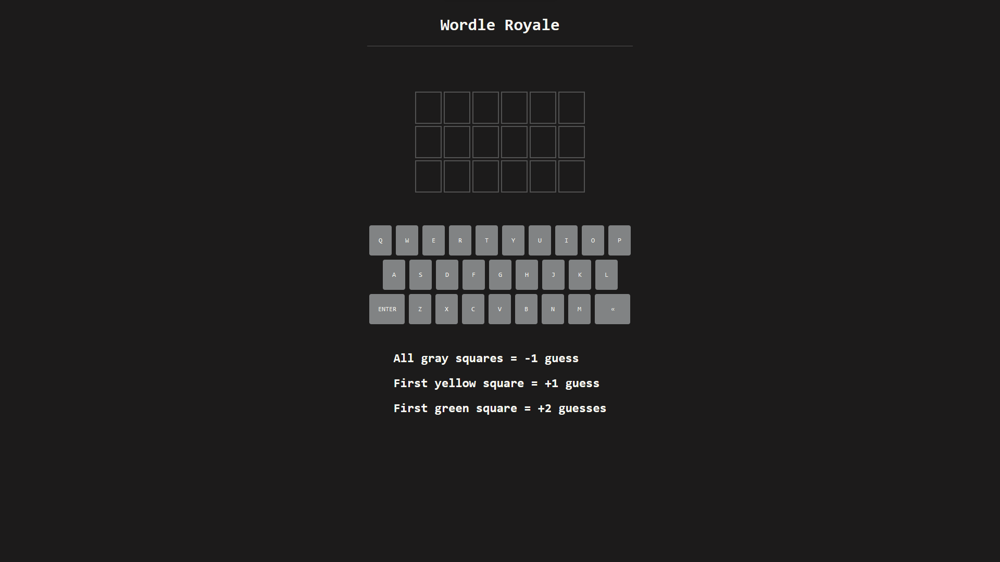

# Wordle Royale

**World Royale** is a spin on the popular web-based word game [Wordle](https://en.wikipedia.org/wiki/Wordle). Traditional Wordle gives players **six chances** to guess a **five letter word**. After each guess, players are **given information via the color of the tile** around each letter. 

The tile colors and their meanings are as follows:

Green - Letter is **in the correct answer** and **in that position** 
Yellow - Letter is **in the correct answer** but **not that position** 
Gray - Letter is **not in the correct answer** at all

### What's Different?

**Wordle Royale** follows the same premise of the original Wordle but with a twist. **Each guess** will either **reward or punish** the player by either **adding or removing the remaining guesses**. In addition, **word length is six letters** instead of five and the **starting number of guesses is three** instead of six.

  

-   [Different Situations](#different-situations)
    -   [All Gray Squares](#all-gray-squares)
    -   [First Yellow Square](#first-yellow-square)
    -   [First Green Square](#first-green-square)
    -   [First Green and Yellow Squares](#first-green-and-yellow-squares)
    -   [Subsequent Green or Yellow Squares](#subsequent-green-or-yellow-squares)
    -   [Winning](#winning)
    -   [Losing](#losing)
-   [Want to Learn More?](#learn-more)

# Different Situations

Due to the addition of rewards and punishments, there are an abundance of different situations a player can run into while playing Wordle Royale. 

_Here are the situations players may find themselves in:_

## All Gray Squares

Any guess with **all gray squares** will result in **losing one of the remaining guesses**.

https://user-images.githubusercontent.com/65800865/183723574-d5966e1a-882c-4ecf-8a80-11a8f22d5e38.mp4

## First Yellow Square

The **first guess** with a **at least one yellow** square will result in gaining **one extra guess**.

https://user-images.githubusercontent.com/65800865/183723744-acd4444a-cd62-4950-ae5f-2bde20b47316.mp4

## First Green Square

The **first guess** with a **at least one green** square will result in gaining **two extra guesses**. Note that in this example the player has **two green squares on this guess but still only receives the reward for one green square**. 

_In the situation a reward has not yet been dealt and the players guess includes multiple of the same color square, the player will receive the reward of just one of the squares._

https://user-images.githubusercontent.com/65800865/183723670-293bc1de-6545-4445-8d71-797b5f3739cd.mp4

## First Green and Yellow Squares

If a player has **not yet used their first yellow or green** square, **both rewards will be dealt** resulting in a gain of **three extra guesses**.

https://user-images.githubusercontent.com/65800865/183723788-ffa74ba6-a0d0-47b1-a557-ae419763a774.mp4

## Subsequent Green or Yellow Squares

**Subsequent green or yellow** squares will yield **no rewards** and **no punishments**.

https://user-images.githubusercontent.com/65800865/183723836-7d8ce2bb-7598-4f20-b53a-db5c064f6c4d.mp4

## Winning

When a player **guesses the correct word, they win** the game.

https://user-images.githubusercontent.com/65800865/183723966-238e38cb-8330-46ad-9612-128bb2176d9e.mp4

## Losing

When a player **runs out of guesses, they lose** the game and are **told what the correct word was**.

https://user-images.githubusercontent.com/65800865/183724021-0bb3e48a-c52f-4b1d-adf4-0d6069ada5eb.mp4

# Learn More

Want to see it in action? [Watch my final project demonstration video!](https://www.youtube.com/watch?v=D_Eb5b_8feQ)
